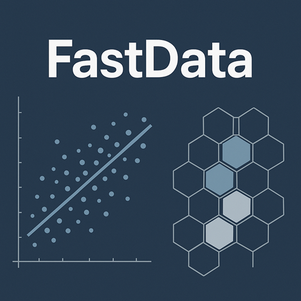
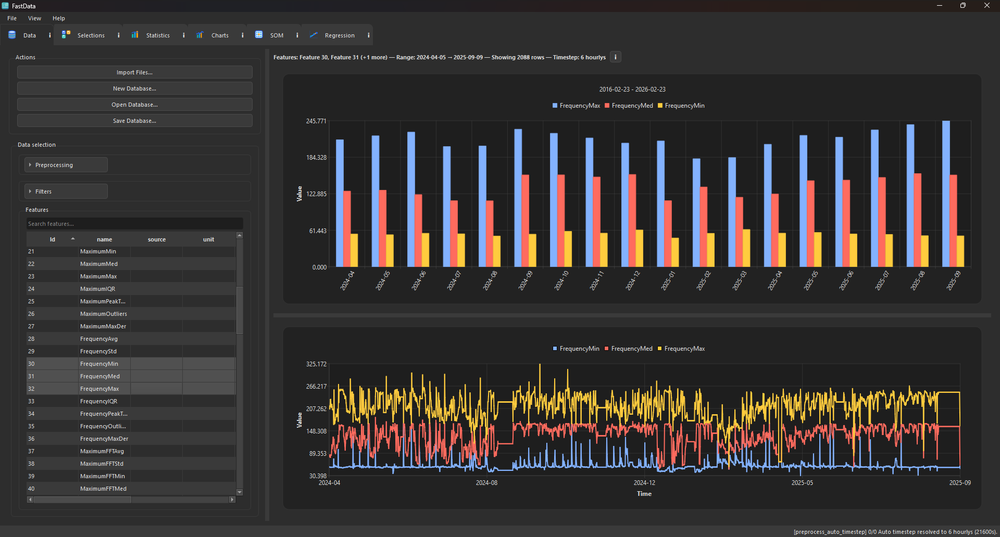
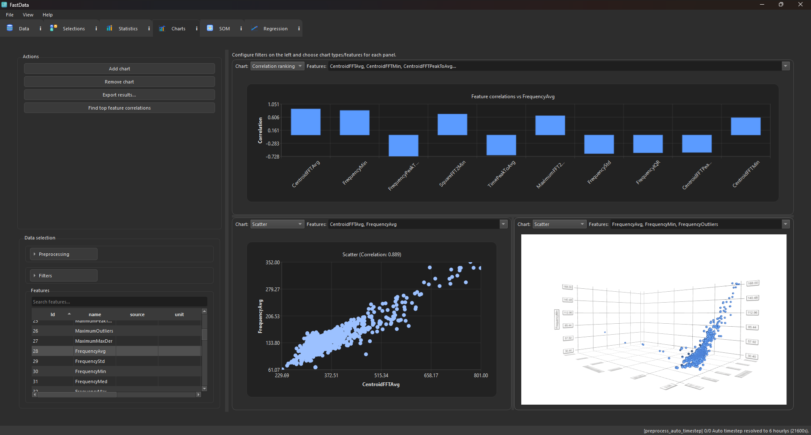
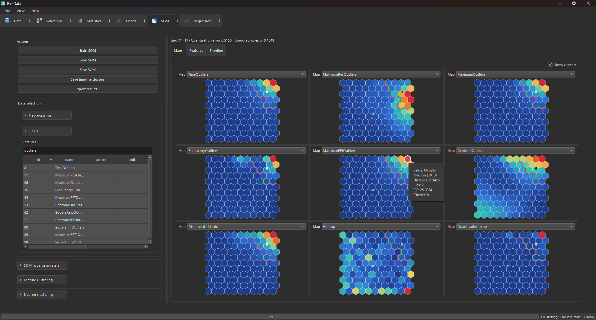
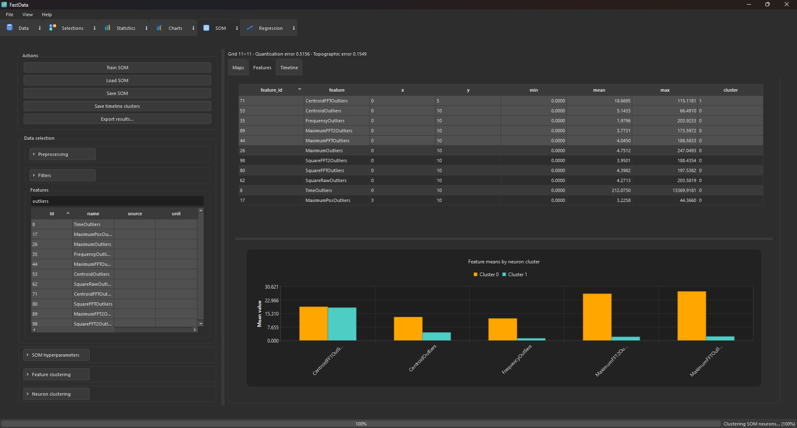
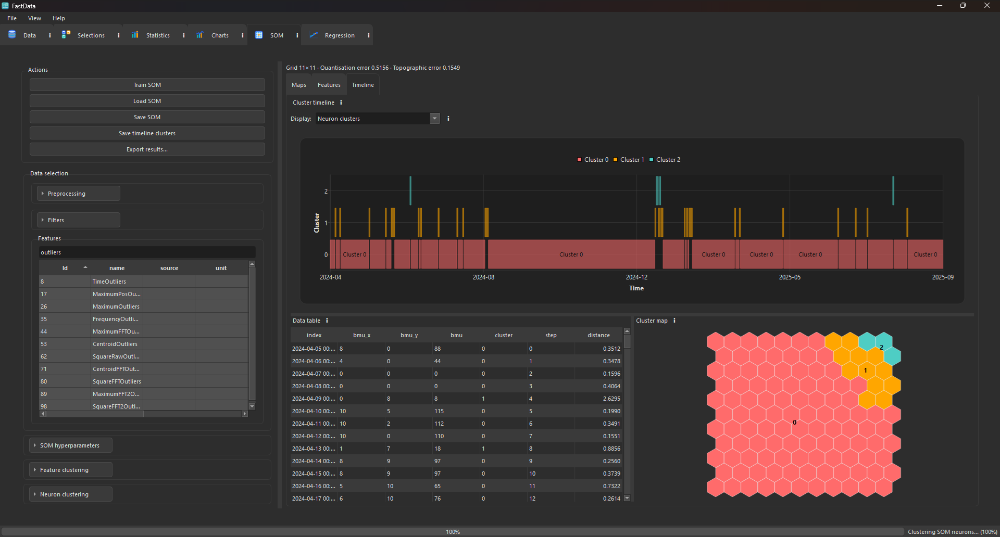
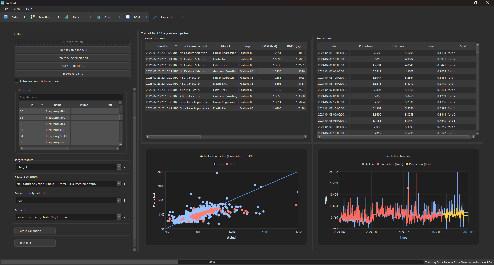
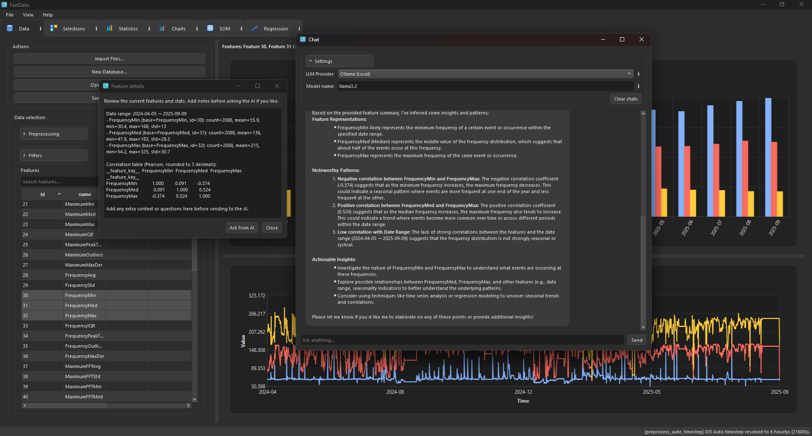

# FastData-Py – Industrial Process Data Analysis Desktop Application



**FastData-Py** is a Python-based desktop application for industrial process data analysis, visualization, and machine learning.  
It is designed for engineers, researchers, and data scientists working with manufacturing, plant, and process datasets who require secure, local-first analytics without cloud dependency.

Developed by Valtteri Tiitta at the University of Eastern Finland (UEF) as part of the project *Materials Solutions in the Green Transition – Visima* (co-financed by the European Union), FastData-Py modernizes and extends an earlier MATLAB-based workflow into a fully integrated Python environment.

The application combines:

- Advanced statistical analysis (PCA, clustering, regression, time-series tools)
- Self-Organizing Maps (SOM) for nonlinear process visualization
- Interactive Qt (PySide6) desktop GUI
- Embedded DuckDB/SQLite data storage
- Optional large-language-model (LLM) assistance for contextual help

## Local-First Architecture

FastData-Py follows a **local-first architecture**:

- All data storage, modeling, and visualization run on the user's machine.
- No cloud backend is required.
- Internet access is optional and only needed when using OpenAI as an LLM provider.
- Fully offline usage is possible via local LLM backends such as Ollama.

This makes FastData-Py suitable for industrial environments where data security, confidentiality, and compliance are critical.

## Typical Use Cases

- Industrial process monitoring and analysis
- Manufacturing data exploration
- PCA and clustering of plant variables
- Regression modeling of process targets
- Self-Organizing Map visualization of complex systems
- Local machine learning experimentation on sensitive datasets

FastData-Py aims to provide a practical desktop alternative to cloud-based analytics platforms while maintaining modern data science capabilities in Python.

## Key Capabilities

- **Process Data Management**  
  Load CSV and Excel datasets and persist them into DuckDB or SQLite databases.  
  Maintain a reproducible audit trail of analysis sessions through automatic logging.

- **Statistical Analysis & Machine Learning**  
  Perform PCA, clustering, regression, and time-series modeling using scikit-learn.  
  Train and visualize Self-Organizing Maps (SOM) via MiniSom for nonlinear pattern discovery.

- **Interactive Desktop GUI**  
  Modern PySide6 (Qt for Python) interface with tabs, dialogs, charts, theming, and contextual panels designed for desktop-first workflows.

- **LLM Assist (Experimental)**  
  Optional OpenAI or Ollama integration for contextual assistance and workflow guidance.  
  Current implementation is lightweight and designed as a foundation for future dataset-aware LLM integration.

- **Integrated Contextual Help System**  
  Structured YAML/JSON help files (`resources/help`) rendered directly inside the application.  
  Documentation can be generated from these files using `scripts/build_help_docs.py`.

## GUI

### Data


### Charts


### Statistics


### SOM




### Regression


### Chat / Help system


## Installation

FastData-Py can be installed using the official Windows installer (recommended) or run from source for development purposes.

---

### Option 1 – Install via Windows Installer (Recommended)

1. Go to the latest release page:  
   https://github.com/valttiuef/FastData-Py/releases

2. Download the installer from the newest version (e.g. `v0.1.1`).

3. Run the installer and follow the setup instructions.

4. Launch **FastData-Py** from the Start Menu.

This is the recommended option for most users working with industrial or research data.

---

### System Requirements

- Windows 10 or newer
- 64-bit system
- No separate Python installation required when using the installer

---

### Option 2 – Run from Source (Developer Mode)

1. **Set up Python 3.9+ and a virtual environment**
   ```bash
   python -m venv .venv
   source .venv/bin/activate
   python -m pip install --upgrade pip
   ```
2. **Install dependencies**
   ```bash
   pip install -e .
   ```
3. **Run the app**
   ```bash
   python src/app.py
   ```
   For VS Code users, you can also use the existing tasks: *Activate venv + Install* then *Run app* or press **F5**.

## Dependencies and licenses

The application itself is released under the **MIT License** (see [LICENSE](LICENSE)).

This software depends on third-party libraries with the following licenses:

| Library | Purpose | License |
| --- | --- | --- |
| PySide6 / PySide6-Addons | Qt-based desktop GUI | LGPL-3.0 (Qt libraries dynamically linked) |
| duckdb | Local analytics database | MIT |
| SQLite (stdlib) | Embedded relational database | Public Domain |
| pandas, numpy | Data wrangling | BSD-3-Clause |
| scikit-learn | PCA, clustering, regression utilities | BSD-3-Clause |
| sktime | Legacy forecasting reference service (not used by active app flow) | BSD-3-Clause |
| MiniSom | Self-Organizing Maps | MIT |
| openai | OpenAI API integration | Apache-2.0 |
| ollama | Local LLM connector | MIT |
| openpyxl | Excel file reader | MIT |
| PyYAML | Help/documentation parsing | MIT |

A complete list of third-party licenses is available in
`resources/third_party_licenses.html`.

### Qt / PySide6 notice

This application uses PySide6 (Qt for Python) under the terms of the
GNU Lesser General Public License v3.0 (LGPL-3.0).

PySide6 and the Qt libraries are used **unmodified** and are
**dynamically linked**. Users may replace the Qt/PySide6 libraries with
compatible versions in accordance with the LGPL.

The full LGPL-3.0 license text is provided in `resources/licenses/LGPL-3.0.txt`.

Always review upstream licenses if you add or redistribute binaries.

## TODO / Known Issues

- **Forecasting (`scikit-learn`)**
  - Disabled until I figure out what is best way to implement this
  - Active forecasting now uses `scikit-learn` models and manual time-based splits.
  - The previous `sktime` implementation is preserved as a non-active reference in `src/backend/services/legacy_forecasting/forecasting_service_sktime.py`.

- **Translations**
  - Current translations are only examples and are incomplete.
  - Proper translation files should be created if multilingual support is required.

- **SQL schema**
  - The current database schema has grown organically and may be confusing in places.
  - A redesign and simplification of the schema should be considered.

- **LLM integration**
  - The current integration is basic and can be extended.
  - Possible improvements:
    - Add conversation history using saved logs
    - Improve message structure for clearer interactions
    - Provide better explanations of underlying models (e.g., decision trees, linear regression)

- **Code quality / refactoring**
  - A significant portion of the codebase was generated with LLM assistance.
  - While functional, it would benefit from systematic cleanup and refactoring.

- **Database structure**
  - Separate databases are currently used for logs, selections, and measurements.
  - Consolidating everything into a single database as the primary source of truth may simplify usage and data sharing.

- **Styling and language switching**
  - Changing theme or language currently requires restarting the application.
  - Dynamic switching would be preferable, but the current theme implementation needs performance improvements.

- **Cross-platform compatibility**
  - The application has only been tested on Windows.
  - Cross-platform testing (Linux, macOS) is needed to ensure compatibility.
  - OS-specific assumptions and dependencies should be reviewed.

- **Import freeze after mixed CSV/Excel sequence**
  - In some sessions, importing a large Excel workbook right after a DuckDB CSV import can appear to stall around sheet/chunk progress (commonly near 40%).
  - The import may continue only after additional UI interaction (for example clicking feature list/chart controls).
  - Workarounds:
    - Restart the app before importing the Excel workbook.
    - Import the Excel workbook into a fresh/opened database first, then import CSV files.

## License
This project is licensed under the MIT License. See [LICENSE](LICENSE) for details.
