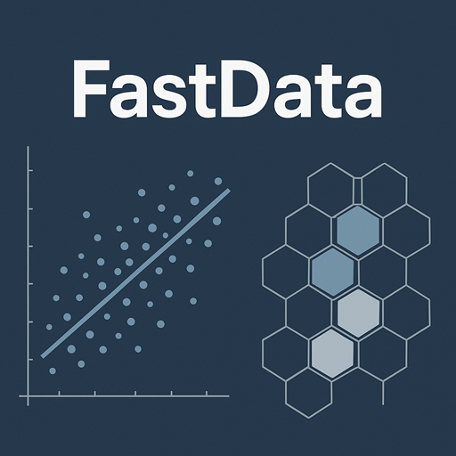
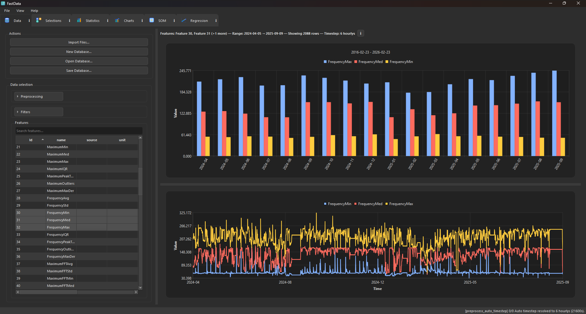
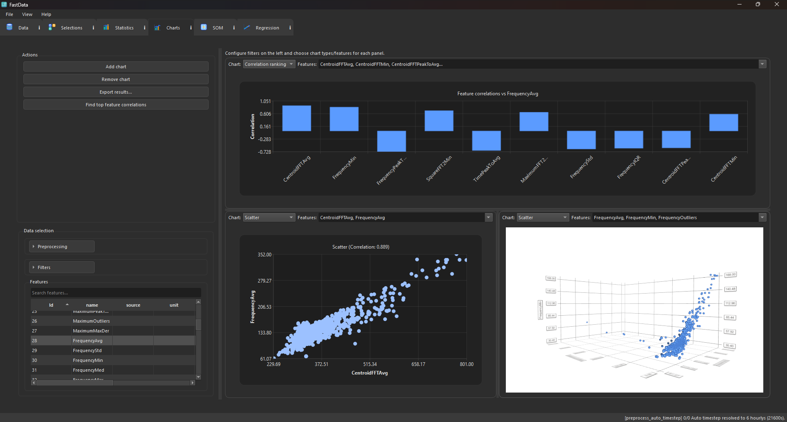
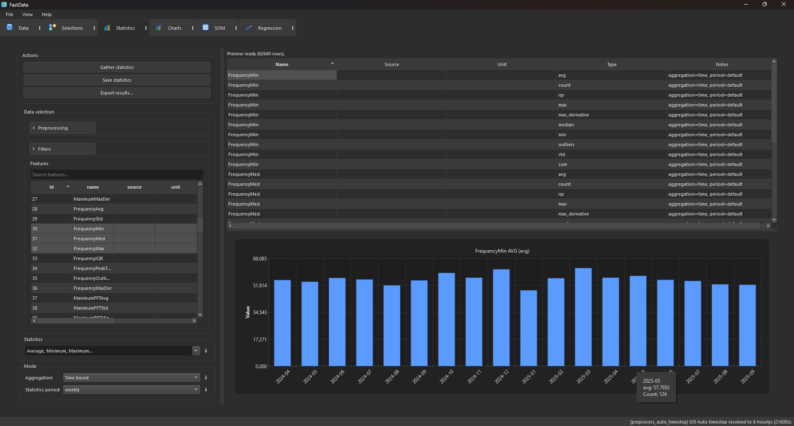
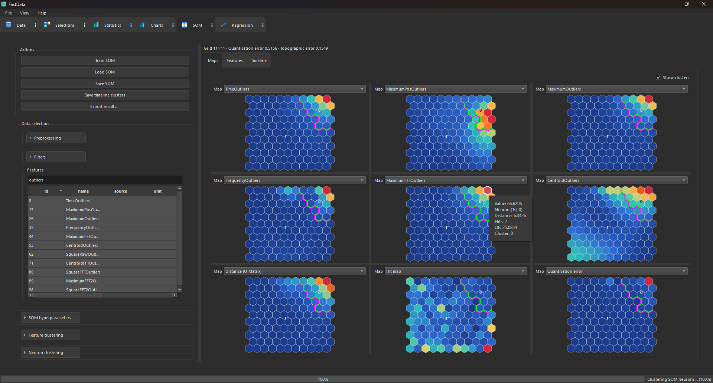
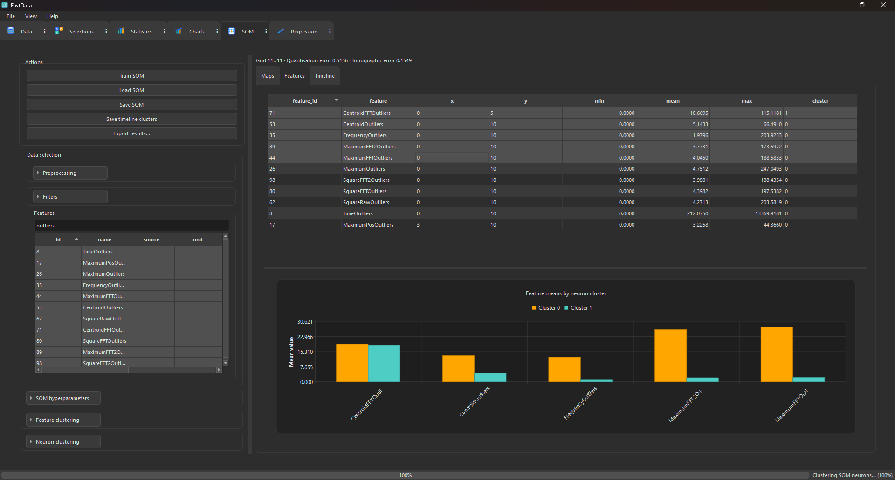
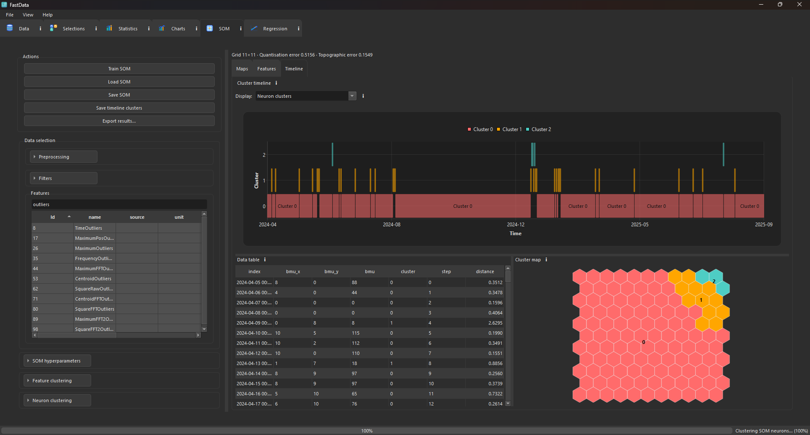
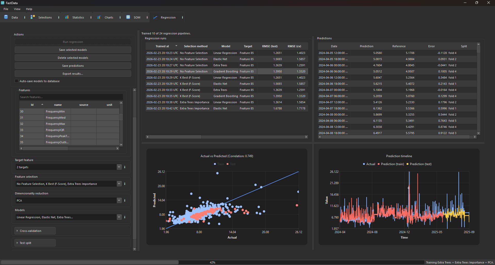
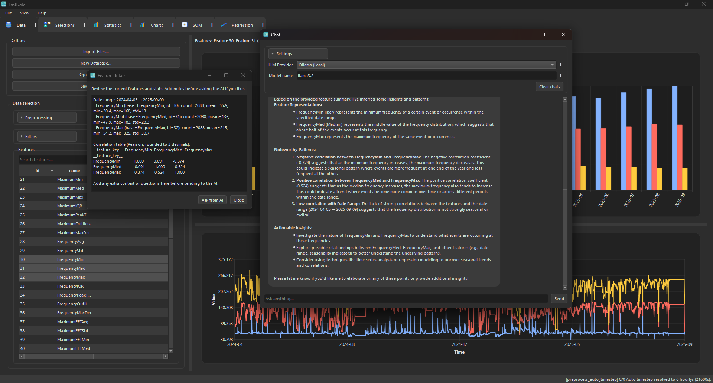

# FastData-Py – Industrial Process Data Analysis Desktop Application

Full documentation:
https://valttiuef.github.io/FastData-Py/

Download latest release:
https://github.com/valttiuef/FastData-Py/releases

---

FastData-Py is a Python-based desktop application for industrial process data analysis, visualization, and machine learning.

It is designed for engineers, researchers, and data scientists working with manufacturing, plant, and industrial process datasets who require secure, local-first analytics without cloud dependency.

Developed by Valtteri Tiitta at the University of Eastern Finland (UEF) as part of the project
Materials Solutions in the Green Transition – Visima (co-financed by the European Union), FastData-Py modernizes and extends an earlier MATLAB-based workflow into a fully integrated Python environment.

The application combines:

- Advanced statistical analysis (PCA, clustering, regression, time-series tools)
- Self-Organizing Maps (SOM) for nonlinear process visualization
- Interactive Qt (PySide6) desktop GUI
- Embedded DuckDB / SQLite data storage
- Optional large-language-model (LLM) assistance for contextual help

FastData-Py aims to provide a desktop-first alternative to cloud analytics tools for industrial environments where data confidentiality and security are critical.

---

# Local-First Architecture

FastData-Py follows a local-first architecture:

- All data storage, modeling, and visualization run on the user's machine.
- No cloud backend is required.
- Internet access is optional and only needed when using OpenAI as an LLM provider.
- Fully offline usage is possible via local LLM backends such as Ollama.

This makes FastData-Py suitable for industrial, research, and manufacturing environments where sensitive data cannot leave local infrastructure.

---

# Settings System

Application settings are centralized behind `src/core/settings_manager.py` and grouped under:

- `general`
- `database`
- `logs`
- `ai`
- `training`
- `charts`
- `components` (generic per-tab/per-sidebar payloads)

Implementation modules live in `src/core/settings/`.

Design goals:

- Use defaults from code as safe fallbacks.
- Persist user overrides through grouped settings APIs.
- Support full export/import/reset flows (`export_all`, `import_all`, `reset_all`).
- Keep component/sidebar settings ready for a future dedicated settings window.

---

# Typical Use Cases

FastData-Py is designed for industrial and research data analysis workflows, including:

- Industrial process monitoring and analysis
- Manufacturing data exploration
- PCA and clustering of plant variables
- Regression modeling of process targets
- Self-Organizing Map visualization of complex systems
- Local machine learning experimentation on sensitive datasets

The application focuses on interactive desktop analysis of process datasets while maintaining modern Python data science capabilities.

---

# Key Capabilities

## Process Data Management

Load CSV and Excel datasets and persist them into DuckDB or SQLite databases.

FastData-Py maintains a reproducible audit trail of analysis sessions through automatic logging and structured data storage.

---

## Statistical Analysis & Machine Learning

Perform statistical and machine learning analysis using scikit-learn, including:

- PCA
- clustering
- regression
- time-series modeling

Self-Organizing Maps are implemented using MiniSom, enabling nonlinear visualization of complex industrial systems.

---

## Interactive Desktop GUI

Modern PySide6 (Qt for Python) desktop interface with:

- tabs and dialogs
- interactive charts
- contextual panels
- application theming

The UI is designed specifically for desktop-first analytical workflows.

---

## LLM Assist (Experimental)

Optional integration with:

- OpenAI
- Ollama (local models)

The feature provides contextual help and workflow guidance.
The current implementation is lightweight and designed as a foundation for future dataset-aware LLM integration.

---

## Integrated Contextual Help System

Structured help files located in:

resources/help

These are rendered directly inside the application.

Documentation pages can also be generated from these files using:

scripts/build_help_docs.py

The generated documentation is published here:

https://valttiuef.github.io/FastData-Py/

---

# GUI

### Data

### Charts

### Statistics

### SOM

### Regression

### Chat / Help System

---

# Installation

FastData-Py can be installed using the official Windows installer (recommended) or run from source for development purposes.

---

## Option 1 – Install via Windows Installer (Recommended)

1. Go to the latest release page:
https://github.com/valttiuef/FastData-Py/releases

2. Download the installer from the newest version (for example v0.1.1).

3. Run the installer and follow the setup instructions.

---

## System Requirements

- Windows 10 or newer
- 64-bit system
- No separate Python installation required when using the installer

---

## Option 2 – Run from Source (Developer Mode)

1. Set up Python 3.9+ and a virtual environment

python -m venv .venv
source .venv/bin/activate
python -m pip install --upgrade pip

2. Install dependencies

pip install -e .

3. Run the application

python src/app.py

For VS Code users, you can also use the included tasks:

- Activate venv + Install
- Run app

or simply press F5.

---

# Dependencies and Licenses

The application itself is released under the MIT License (see LICENSE).

This software depends on third-party libraries with the following licenses:

| Library | Purpose | License |
|---|---|---|
| PySide6 / PySide6-Addons | Qt-based desktop GUI | LGPL-3.0 |
| duckdb | Local analytics database | MIT |
| SQLite (stdlib) | Embedded relational database | Public Domain |
| pandas, numpy | Data wrangling | BSD-3-Clause |
| scikit-learn | PCA, clustering, regression utilities | BSD-3-Clause |
| sktime | Legacy forecasting reference service | BSD-3-Clause |
| MiniSom | Self-Organizing Maps | MIT |
| openai | OpenAI API integration | Apache-2.0 |
| ollama | Local LLM connector | MIT |
| openpyxl | Excel file reader | MIT |
| PyYAML | Help/documentation parsing | MIT |

A complete list of third-party licenses is available in:

resources/third_party_licenses.html

---

## Qt / PySide6 Notice

This application uses PySide6 (Qt for Python) under the terms of the GNU Lesser General Public License v3.0 (LGPL-3.0).

PySide6 and the Qt libraries are used unmodified and are dynamically linked. Users may replace the Qt/PySide6 libraries with compatible versions in accordance with the LGPL.

The full LGPL-3.0 license text is provided in:

resources/licenses/LGPL-3.0.txt

Always review upstream licenses if you add or redistribute binaries.

---

# TODO / Known Issues

### Forecasting (scikit-learn)

- Disabled until a suitable long-term implementation strategy is finalized.
- Active forecasting currently uses scikit-learn models with manual time-based splits.
- The previous sktime implementation is preserved as a reference:

src/backend/services/legacy_forecasting/forecasting_service_sktime.py

### Translations

- Current translations are only examples and incomplete.
- Proper translation files should be created if multilingual support is required.

### LLM Integration

The current integration is intentionally lightweight and can be extended.

Possible improvements include:

- improved message structure for clearer interactions
- explanations of underlying models (decision trees, linear regression, etc.)

### Database Structure

- Separate databases are currently used for logs, selections, and measurements.
- Consolidating everything into a single database may simplify usage and data sharing.

### Cross-Platform Compatibility

The application has primarily been tested on Windows.

Additional testing is required for:

- Linux
- macOS

OS-specific assumptions and dependencies should be reviewed to ensure full compatibility.

---

# License

This project is licensed under the MIT License.

See the LICENSE file for details.
